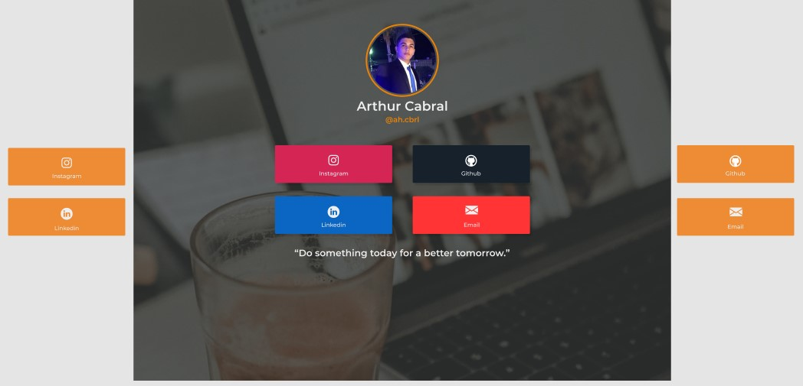

# Insta-Link

### Protótipo desenvolvido no Figma:

### Link: https://urless.in/VLGNV

## Objetivo: Fazer algo diferente das demais fast-pages (eu atribuí esse nome kkk) que eu via, como a linktree.

### Modo: Adicionando efeitos simples, tanto na foto do perfil, quando na página total em si (botões e etc.), tudo feito de modo personalizado.

## Ícones

- :package: Nova Funcionalidade 

- :up: Atualização

- :beetle: Correção de Bug

- :checkered_flag: Release (Entrega de uma Parte Funcional)

## Status atual do projeto: Finalizado e postado.

